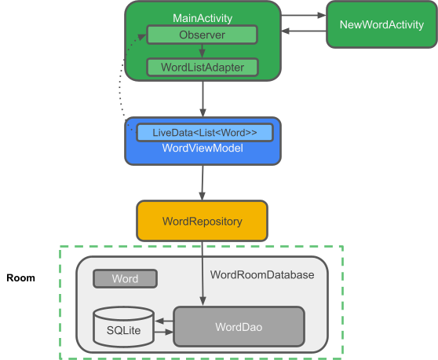

# Android Jetpack Compose Profesional Proyect

I build this repository to have a variety of basic, util and powerful applications. Each of these
ready to embed on any professional project.
Here can you find developer features as:

* Clean Arquitecture
* Dependencies injection
* ROOM local data base
* Coroutines
* Retrofit
* LiveData
* MVVM
* Flows

## Android Developers Source

* ROOM:  https://developer.android.com/codelabs/android-room-with-a-view-kotlin?hl=es-419#0

## Concepts

### Clean arquitecture

Allow implement SOLID principles.

#### Layers:

* Di
* Core
* Data
* Domain
* Presentation

### LiveData: Una clase contenedora de datos observable. Siempre conserva o almacena en caché la última versión de los datos, y notifica a los observadores cuando los datos han cambiado. LiveData está optimizado para los ciclos de vida. Los componentes de IU solo observan los datos relevantes y no detienen ni reanudan la observación. LiveData se ocupa automáticamente de todo esto, ya que está al tanto de los cambios de estado del ciclo de vida relevantes mientras lleva a cabo la observación.

### ViewModel: Actúa como un centro de comunicación entre el repositorio (datos) y la IU. La IU ya no tiene que preocuparse por el origen de los datos. Las instancias de ViewModel sobreviven a la recreación por actividad o fragmento.

### Repositorio: Es una clase que creas que se usa principalmente para administrar varias fuentes de datos.

### Entidad: Es una clase anotada que describe una tabla de base de datos cuando se trabaja con Room.

### Base de datos de Room: Simplifica el trabajo de la base de datos y sirve como punto de acceso a la base de datos SQLite subyacente (oculta SQLiteOpenHelper)). La base de datos de Room usa el DAO para enviar consultas a la base de datos SQLite.

### Base de datos SQLite: Es el almacenamiento del dispositivo. La biblioteca de persistencias de Room crea y mantiene esta base de datos por ti.

### DAO: Es el objeto de acceso a datos. Es un mapeo de búsquedas de SQL a las funciones Si usas un DAO, tú llamas a los métodos y Room se encarga del resto.

### Flows

Un flujo es una secuencia asíncrona de valores. Flow produce valores de a uno (en lugar de todos
juntos) que pueden generar valores a partir de operaciones asíncronas, como solicitudes de red,
llamadas a bases de datos o cualquier otro código asíncrono. Admite corrutinas en toda su API, por
lo que también puedes transformar un flujo utilizando corrutinas

## ¿Qué es una base de datos Room?

Room es una capa de base de datos sobre una base de datos SQLite.
Room se ocupa de las tareas rutinarias de las que solías encargarte con SQLiteOpenHelper.
Room usa el DAO para enviar consultas a su base de datos.
De manera predeterminada, para evitar un rendimiento deficiente en la IU, Room no permite enviar
consultas en el subproceso principal. Cuando las consultas de Room muestran Flow, las consultas se
ejecutan automáticamente de manera asíncrona en un subproceso, en segundo plano.
Room proporciona comprobaciones de tiempo de compilación de las sentencias de SQLite.

## Arquitecure Description

### Example Codes

## Create Entitie and DAO

<pre>
@Entity
data class ImageEntity(
@PrimaryKey(autoGenerate = true)
val id: Long = 0,
val imageUrl: String, // URL de la imagen (puedes usarlo como identificador único)
val localFilePath: String // Ruta local donde se almacenó la imagen
)
</pre>

<pre>
@Dao
interface ImageDao {
    @Insert(onConflict = OnConflictStrategy.REPLACE)
    suspend fun insertImage(image: ImageEntity)

    @Query("SELECT * FROM ImageEntity WHERE imageUrl = :imageUrl")
    suspend fun getImageByImageUrl(imageUrl: String): ImageEntity?
}
</pre>

